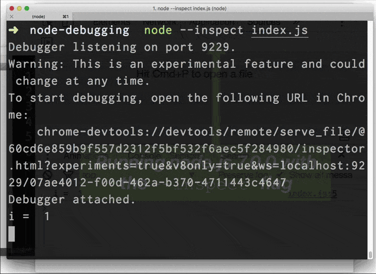

# Node.js Hot Reload

## What is hot code reloading?

Hot code reloading is a feature of a language runtime or its environment which makes possible applying changes to the code at run time without stopping the system.

An example of using a similar technique:

_Credits: https://umaar.com/dev-tips/119-node-js-hot-code-swap/_

TODO: describe the constraint of separation of code and data

## Further reading

1. [Hot swapping](https://en.wikipedia.org/wiki/Hot_swapping#Software)
1. [Debugging Node.js with Google Chrome](https://medium.com/p/4965b5f910f4)
1. [Hacker News - Hot code reloading with Erlang](https://news.ycombinator.com/item?id=10669131)
1. [Zero downtime - Hot code deployments](https://csparpa.github.io/blog/2016/10/zero-downtime-hot-code-deployments.html)
1. [Live Editing JavaScript with Webpack (Part III)](https://jlongster.com/Backend-Apps-with-Webpack--Part-III)

